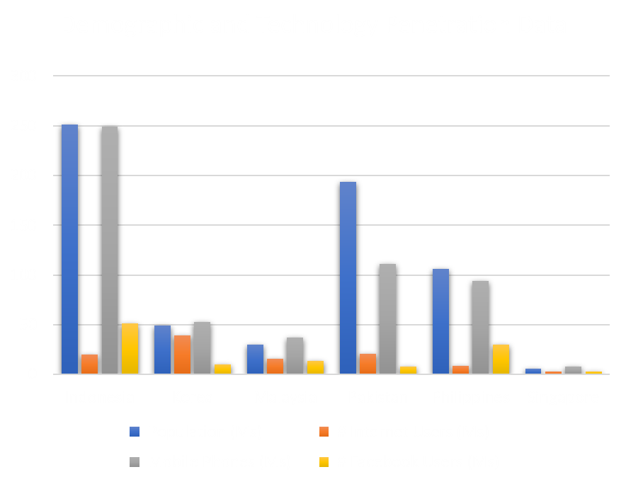
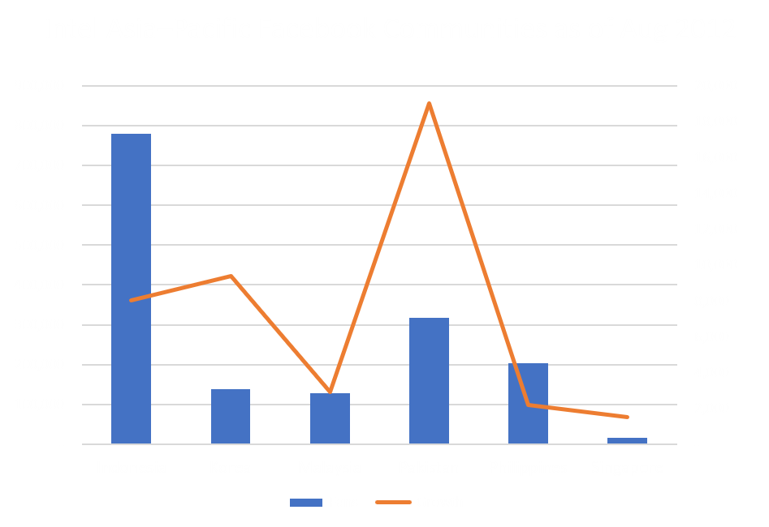
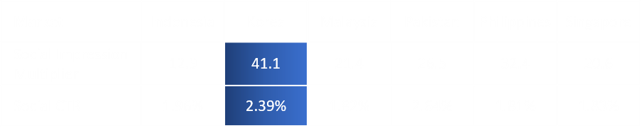
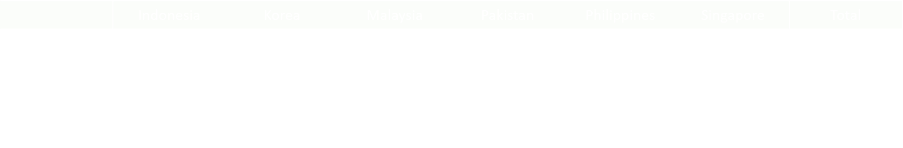

# Intel Asia-Pacific : The Catch & Win Campaign

==- Hult SF MsBA2 - Team 14
- Percival Sibanda
- Jisung Jung
- Neha Gupta
- Sushmasri Takillapati
===

## The Catch & Win Campaign Strategy in Asian market

The primary competitors for Intel are the other processor manufacturers such as AMD and mobile tech companies such as Qualcomm. To overcome competition, Intel ventured into the markets with prospective customer base to enhance experience in order to which Intel & Ultrabooks are the primary factor to make a PC attractive.

The campaign targeted six Asian emerging country markets; Indonesia, South Korea, Malaysia, Pakistan, the Philippines and Singapore. The campaign targeted the growing population of young people who use smartphones for entertainment and to stay connected with their friends.

Consumers relied heavily on the opinions of their social connections such as their peers, friends, and family for buying decisions ,especially for large purchases such as PCs. Consumers tend to put considerable efforts into ensuring that their choice was the best value.  Advertising program was developed to maximize the number of downloads of the smartphone app, “Pocket Intel,” which encouraged participation and interest in Catch & Win contest. 

## Interpretation on emerging market data

  

As shown the chart, we can see that the demand for mobile phones was growing fast, becoming the best way to reach consumers than Internet. Indonesia and Pakistan have substantial mobile phone users – more than 100 millions. Hence, Intel had invested in building its own Facebook communities in the Asia-Pacific region. 

  

From the Intel team’s previous experience with Facebook communities in the countries of interest, it had developed estimates about the typical Social Impression Multipliers and Social CTRs. In terms of the impression multiplier and CTR value, we can assume that Korea can potentially reach more impressions and clicks than other candidate countries.

## Problem Statement

The purpose of the marketing team is to drive interest in consumers through campaign worth $95,000. 

The initial media purchase plan of $95,000 failed to include the 9 percent fee for the agency (Impact Marketing Ltd.), so we need to scale it back to account for that. 

We must achieve greater overall impressions and clicks optimizing the media plan for the Catch & Win 2.0 campaign

## The optimal solution to LP Model for Max. the number of impressions

Refer to excel file - [Linear Programming for Intel Asia Campaign.xlsx](https://drive.google.com/file/d/13RulfGhKKtB1fWLSSFI8TqGMzrC6E2sz/view?usp=sharing)

The solution reveals that the maximum number of impression of 73,312,500 occurs with the following decision variables for impressions table. Total click-throughs is 91,924

Hence, Marketplace Ads will be purchased 6,053,125 impressions more than original purchase plan. Premium Ads will be purchased 4,162,500 impressions less than original one. Mobile Ads will be purchased 12,771,875 impressions more than original purchase. 

If the objective coefficient remains within the ranges of optimality, the optimal solution will not change. The shadow price indicates that increasing the one additional RHS unit will increase the value of objective function. 

## The optimal solution to LP Model for Max. the number of click-throughs

Refer to excel file - [Linear Programming for Intel Asia Campaign.xlsx](https://drive.google.com/file/d/13RulfGhKKtB1fWLSSFI8TqGMzrC6E2sz/view?usp=sharing)

The solution reveals that the maximum number of click-throughs of 99,576 occurs with the following decision variables for impressions table. Total impression is 68,462,500

Hence, Marketplace Ads will be purchased 17,498,242 impressions more than original purchase plan. Premium Ads will be purchased 3,935,742 impressions less than original one. Mobile Ads will be purchased 3,750,000 impressions less than original purchase. 

If we increase additional $1 budget, the value of objective function will increase by 1.224 click-throughs. There are 18 binding constraints, having zero slack. For constraint 19, Korea has 4.85m slack which remains unused.

## The Modified Linear Programming Model 

We are going to explore the possibility of driving more consumers' interest by additional purchase on Mobile Ads in Korea, so that we will expect unused capacity in total impressions in Korea could be shifted to be available. 

Refer to excel file - [Linear Programming for Intel Asia Campaign.xlsx](https://drive.google.com/file/d/13RulfGhKKtB1fWLSSFI8TqGMzrC6E2sz/view?usp=sharing)

While we assume the unit cost per 1,000 impressions (CPM) for Mobile Ads CPM in Korea is $0.40, we can add a missing constraint in the established model. No Mobile Ad / Korea combination falls below 75 percent of the originally proposed number of impressions. 

The solution reveals that the maximum number of click-throughs of 99,598 occurs with the following decision variables for impressions table. Total impression is 70,639,375, slack reduces by 2,176,875

## Recommendations

After the quantitative analysis and linear programming, we would recommend that :

From two different objective function LP models, we recognized that 

1) More focus should be on Facebook Marketplace Ads and Mobile Ads but less focus on Premium and in order to gain Max. the number of impressions

2) More focus should be on Facebook Marketplace Ads but less focus on Premium and Mobile Ads in order to gain Max. the number of click-throughs

Max impression LP model would be more cost effective as an opening step/strategy in order to generate interest in the market they are trying to break into. Entering using click through rates as a metric would be too early at this stage because they are still trying to generate interest. 

In the coming future, more emphasis must be placed on Mobile Ads in the Indonesian and Pakistan markets because currently there are more people who use mobiles. Indonesia and Pakistan have a much higher figure when it comes to number of mobile users when compared to Internet users, it would be more cost effective to use mobile ads first for those countries. More people have access to the interest with the growing adoption of mobile devices than PC devices meaning we can target their mobile Ads first and non-mobile Ads later.

Close attention must be paid to markets with a high Social Impression Multiplier as these are markets that have most organic reach. Social Impression multiplier refers to the amount of organic attention or reach that an Ad can have. This means that we will have a much larger audience to advertise to in a much more organic way. The more organic and Ad feels, the more a potential customer will be likely to click on the Ad.  

We should drive more consumers' interest by additional purchase on Mobile Ads in Korea. Without changing any budget constraint, we are able to get higher number of click-throughs and number of impressions than #2 Max. Click-throughs LP Model. 

## Takeaways

- With the linear programming method, Intel’s campaign budget  can be well allocated and finalize the plan with optimal results.
- Sensitivity Analysis report will help management to decide about their further marketing strategies.
- This method would be applied for various digital marketing department regarding their ad strategies and annual budget planning.

------

## Appendix

### Linear Programming Model to maximize the number of impressions

- Objective function
     - Maximizing the total sum of impressions while maintaining a budget.
- Decision variables
     - Decision variables must be the number of impressions each social advertising plan purchased

### Linear Programming Model to maximize the number of click-throughs

- Objective function
     - Following relationship between the CTR and the impression is used:
       
     - The following formula for generating the number of click-throughs given a CTR (%) : 
       
     - A function that achieves this goal is maximize the number of click-throughs by optimizing the media plan 
- Decision variables 
     - Decision variables must be the number of impressions each social advertising plan purchased

