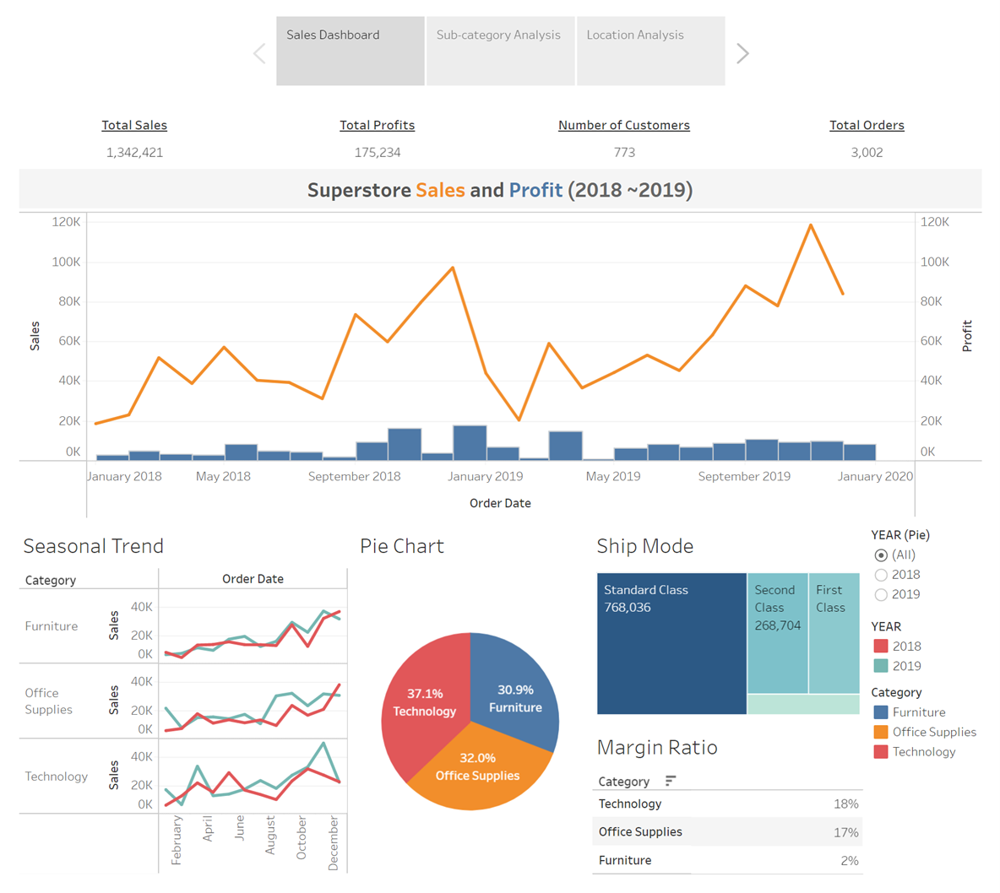

# Superstore Interactive Dashboard

Jisung Jung

You can see the interactive chart and KPIs prepared by the tableau dashboard when you click [this link.](https://public.tableau.com/views/Data-DrivenStrategicRecommendationsandBusinessReport_16194722823160/StoryPoint?:language=en&:retry=yes&:display_count=y&:origin=viz_share_link)

This report is about the representation of the performance in sales and profit for superstore company during the most recent 24-month period. 

## Sales and Profit at a glance

### Company Overall Sales and Profit

In 2018 and 2019, total sales amount $1,342,421 and total profit is $175,234. 773 customers bought products at the company with 3,002 orders. Each year of revenue information is as below.

| Year              | Sales     | Profits  | Customers | Orders  | ARPU    | AOV   |
|-------------------|----------:|---------:|----------:|--------:|--------:|------:|
| 2018              | $609,206  | $81,795  | 638       | 1,315   | $955    | $463  |
| 2019              | $733,215  | $93,439  | 693       | 1,687   | $1,058  | $435  |
| Diff. ('19 - '18) | $124,009  | $11,644  | 55        | 372     | $103    | $-29  |
| Diff. (%)         | 20%       | 14%      | 9%        | 28%     | 11%     | -6%   |

In the table above, the average revenue per user (ARPU) in 2019 was $1,058 which was increased by 11%. Since the average order value (AOV) in 2019 was $435 which was decreased by 6%, marginal profit did not increase substantially as much as marginal sales.

In the time-series graph, we can identify that sales were increasing over time. The highest month of sales was November 2019 at $118,448. Compared to December 2018, the highest revenue month of the former year, sales amount increased by $21,449 but profit amount decreased by $8,195 due to minus margin of product sales in machines, tables, and binders which will be discussed in a later section. The lowest sales happened in every early year for example $18,542 sales in January 2018 and $20,301 sales in February 2019. Every April and October, product sales had slightly shrunk then grew rapidly next month drawing the V-shape. After the high profit earned of $14,752 in March 2019, the monthly profit did not improve a lot for a year.

### Overall Sales by Merchandise Category

Superstore is selling mass merchandise of consumer products such as paper, table, phones across the United States. Individual merchandise items are categorized into furniture, office supplies, and digital gadget (technology). Revenues of each category have changed according to the season. In the second half of 2019, office supplies and technology goods were sold quite a lot of volume than last year and led to changing sales share rates and margin ratio like below table. Whereas technology goods sales share did not much change from the previous 2018 year but increased its profit margin, sales share for office supplies goods in 2019 changed better by 3.4% than 2018 but decreased its profit margin by 3%.

<table class="tg" align="center">
<thead>
  <tr>
    <th class="tg-9wq8" rowspan="2">Category</th>
    <th class="tg-c3ow" colspan="2">Sales Share Rates</th>
    <th class="tg-c3ow" colspan="2">Increased by</th>
  </tr>
  <tr>
    <td class="tg-c3ow" align="center">2018</td>
    <td class="tg-c3ow" align="center">2019</td>
    <td class="tg-c3ow" align="center">2018</td>
    <td class="tg-c3ow" align="center">2019</td>
  </tr>
</thead>
<tbody>
  <tr>
    <td class="tg-0pky">Technology</td>
    <td class="tg-c3ow" align="right">37.20%</td>
    <td class="tg-c3ow" align="right">37.10%</td>
    <td class="tg-c3ow" align="right">17.60%</td>
    <td class="tg-c3ow" align="right">18.70%</td>
  </tr>
  <tr>
    <td class="tg-0pky">Furniture</td>
    <td class="tg-c3ow" align="right">32.60%</td>
    <td class="tg-c3ow" align="right">29.40%</td>
    <td class="tg-c3ow" align="right">3.50%</td>
    <td class="tg-c3ow" align="right">1.40%</td>
  </tr>
  <tr>
    <td class="tg-0pky">Office Supplies</td>
    <td class="tg-c3ow" align="right">30.20%</td>
    <td class="tg-c3ow" align="right">33.60%</td>
    <td class="tg-c3ow" align="right">19.10%</td>
    <td class="tg-c3ow" align="right">16.10%</td>
  </tr>
</tbody>
</table>

When we classify our sales by shipping mode, we can see that standard class shipping was preferred by the customer, by the way, there was an increasing demand for first-class shipping mode in 2019.

<table align="center">
<thead>
  <tr>
    <th rowspan="2">Category</th>
    <th rowspan="2">Revenue Total</th>
    <th colspan="2">Year </th>
    <th rowspan="2">Increased by</th>
  </tr>
  <tr>
    <td align="center"><b>2018</b></td>
    <td align="center"><b>2019</b></td>
  </tr>
</thead>
<tbody>
  <tr>
    <td>Standard Class</td>
    <td align="right">768,036</td>
    <td align="right">372,432</td>
    <td align="right">395,604</td>
    <td align="right">23,172</td>
  </tr>
  <tr>
    <td>Second Class</td>
    <td align="right">268,704</td>
    <td align="right">120,002</td>
    <td align="right">148,702</td>
    <td align="right">28,700</td>
  </tr>
  <tr>
    <td>First Class</td>
    <td align="right">222,400</td>
    <td align="right">82,265</td>
    <td align="right">140,134</td>
    <td align="right">57,869</td>
  </tr>
  <tr>
    <td>Same Day</td>
    <td align="right">83,282</td>
    <td align="right">34,506</td>
    <td align="right">48,776</td>
    <td align="right">14,270</td>
  </tr>
  <tr>
    <td>Grand Total</td>
    <td align="right">1,342,421</td>
    <td align="right">609,205</td>
    <td align="right">733,216</td>
    <td align="right">124,011</td>
  </tr>
</tbody>
</table>
 

## Sales Analysis grouped by Sub-Category

<figure>

<figcaption align="center"> < Filter and Highlight by Technology Goods > </figcaption>
</figure>

<figure>

<figcaption align="center"> < Filter and Highlight by Furniture and Office Supplies Goods > </figcaption>
</figure>

### Top sales goods and its margin ratio

Superstore is providing a broad assortment of goods in the 17 sub-categories. The bar chart shows the leading sales goods in a descending order grouped by category. The total top 10 sales goods ranks are as below.

<table align="center">
<thead>
  <tr>
    <th>Overall Rank</th>
    <th>2019 Rank</th>
    <th>2018 Rank</th>
    <th>Sub-category</th>
    <th>Sales</th>
    <th>Margin Ratio</th>
    <th>Top Customer</th>
  </tr>
</thead>
<tbody>
  <tr>
    <td align="center">1</td>
    <td align="center">1</td>
    <td align="center">2</td>
    <td>Phones</td>
    <td align="right">184,303</td>
    <td align="right">12%</td>
    <td>Karen Ferguson</td>
  </tr>
  <tr>
    <td align="center">2</td>
    <td align="center">2</td>
    <td align="center">1</td>
    <td>Chairs</td>
    <td align="right">179,473</td>
    <td align="right">7%</td>
    <td>Seth Vernon</td>
  </tr>
  <tr>
    <td align="center">3</td>
    <td align="center">4</td>
    <td align="center">4</td>
    <td>Storage</td>
    <td align="right">128,466</td>
    <td align="right">11%</td>
    <td>Karen Ferguson</td>
  </tr>
  <tr>
    <td align="center">4</td>
    <td align="center">3</td>
    <td align="center">6</td>
    <td>Binders</td>
    <td align="right">122,471</td>
    <td align="right">15%</td>
    <td>Adrian Barton</td>
  </tr>
  <tr>
    <td align="center">5</td>
    <td align="center">6</td>
    <td align="center">3</td>
    <td>Tables</td>
    <td align="right">121,727</td>
    <td align="right">-9%</td>
    <td>Joe Elijah</td>
  </tr>
  <tr>
    <td align="center">6</td>
    <td align="center">5</td>
    <td align="center">7</td>
    <td>Copiers</td>
    <td align="right">112,499</td>
    <td align="right">38%</td>
    <td>Tamara Chand</td>
  </tr>
  <tr>
    <td align="center">7</td>
    <td align="center">7</td>
    <td align="center">8</td>
    <td>Accessories</td>
    <td align="right">101,842</td>
    <td align="right">25%</td>
    <td>Helen Wasserman</td>
  </tr>
  <tr>
    <td align="center">8</td>
    <td align="center">8</td>
    <td align="center">5</td>
    <td>Machines</td>
    <td align="right">99,452</td>
    <td align="right">0%</td>
    <td>Bill Shonely</td>
  </tr>
  <tr>
    <td align="center">9</td>
    <td align="center">9</td>
    <td align="center">11</td>
    <td>Appliances</td>
    <td align="right">68,977</td>
    <td align="right">19%</td>
    <td>Helen Wasserman</td>
  </tr>
  <tr>
    <td align="center">10</td>
    <td align="center">11</td>
    <td align="center">9</td>
    <td>Furnishings</td>
    <td align="right">56,789</td>
    <td align="right">14%</td>
    <td>Adrian Barton</td>
  </tr>
</tbody>
</table>

### Examining Transaction History Details

In the technology goods, phones were the best-selling goods in 2019 and overall term with a near company's overall margin ratio (13%). They were sold remarkably in December 2018, September, and November 2019. Profits were positive if the sales amounts were more than $2,000 per order. One of the top customers is Karen Ferguson who spent $4,249. The 2^nd^ rank of selling goods is copiers in total revenues of $112,499. Though the number of sales quantity and orders were lowest among sub-category goods, the copier is profitable due to the high unit price ($792) and high margin ratio (38%). One more thing we need to give special attention to is machines that have a zero-margin ratio. When we look at the scatter plot, there are 3 orders which gave us serious damage to net income for the company. As the dealer sold 3D printers and laser printers to customers at a 50% and 70% discounted price respectively, about $13,840 cash flow declined after all.

In furniture goods, chairs were a lucrative income source for the company. Their sales increased in the second half of every year and they were less damaged losing profits. Seth Vernon was the largest consumer of furniture goods, chairs accounted for almost 83 percent of his all furniture goods. The 2^nd^ rank of selling goods is tables which was the less worthwhile income source for the company. Even though they had high sales in the fourth quarter in 2018 and 2019, their margins became minus due to the huge discounts. Since they were selling tables with the low average unit price at $166, discounting goods by 20% could lead to zero profit.

In the office supplies group, storage and binders were made high sales. Storage had a positive sales trend in 2019, meanwhile, binders had negative sales trend after August 2019. Adrian Barton was the largest consumer of office supplies goods, binders accounted for almost 99 percent of all his office supplies goods. Like the machine goods, binders also gave us serious damage to net income for the company due to the huge discount marketing strategy.  

## Superstore Location Analysis

<figure>

<figcaption align="center"> < Sales Concentration in the United States > </figcaption>
</figure>

### Overall Sales by Regions

Sales establishments are largely placed in the Pacific Northwest, South Central, western, midwestern, and northeastern regions of the United States. Those regions are the most populated in the states, as well as the highest white-collar occupation areas. If we try to concentrate more on white-collar clients, there will be higher chances to be able to make a sale. Like a San Francisco city, densely populated and mostly in white-collar major cities will be expected to grow the sales of our merchandise goods.

### Top Sales Cities and its Profits

1. **Pacific Northwest and Western**: In 2019, there is a stunning growth in Seattle for sales and profits because Consumer and Corporate segment had higher demands on high margin goods such as copiers and accessories. Meanwhile, San Diego dropped its sales in 2019 year due to the low demands for machine and accessories goods in the Consumer segment. In Los Angeles, copier, binder, and accessories sales increased greatly, but phones sales decreased and less profitable than the 2018 year.

2. **Midwestern and Northeastern:** Both New York City and Philadelphia held the top sales markets in the northeastern region, but Philadelphia seems not to improve its profit performance on 7 sub-categories (Machines, Binders, Storage, Supplies, Tables, Chairs, Phones) with -40% average margin ratio and -$8,246 profit loss. Detroit and Chicago held the top sales markets in the midwestern region, but Chicago's profits in 2019 have decreased despite sales increased by $3,178.

3. **South Central:** Both Houston and Dallas held the top sales markets in the south-central region. We can see that demands were various into the sub-categories, but they could not attain the high margins and experienced a huge profit loss on binders goods. We would generate traffic and increase revenue at a higher margin if we invest most of our advertising dollars on advertisements, social media ads, and customer relationship management in the Houston and Dallas areas. Considering that there was an upward trend pattern increasing sales of Technology goods, focusing advertising on phones, copiers and accessories and machines will be potential and effective to reach the higher sales and profits in the future.  

## Summary

In this report, we examined superstore's interactive dashboards, and identified findings and insights from data visualization. By interpreting sales performance charts, we figure out the seasonal buying patterns under the different categories and shipping modes, identifying risk factors. By examining top sales sub-category goods and transaction history details, we evaluated margin ratio and profitable goods, figuring out adequate discount rates for the lucrative income sources. By analyzing sales locations under different categories and segments, we could offer budgeting recommendations to increase sales and profit. However, we have to look through additional data and conduct further research to corroborate our findings.