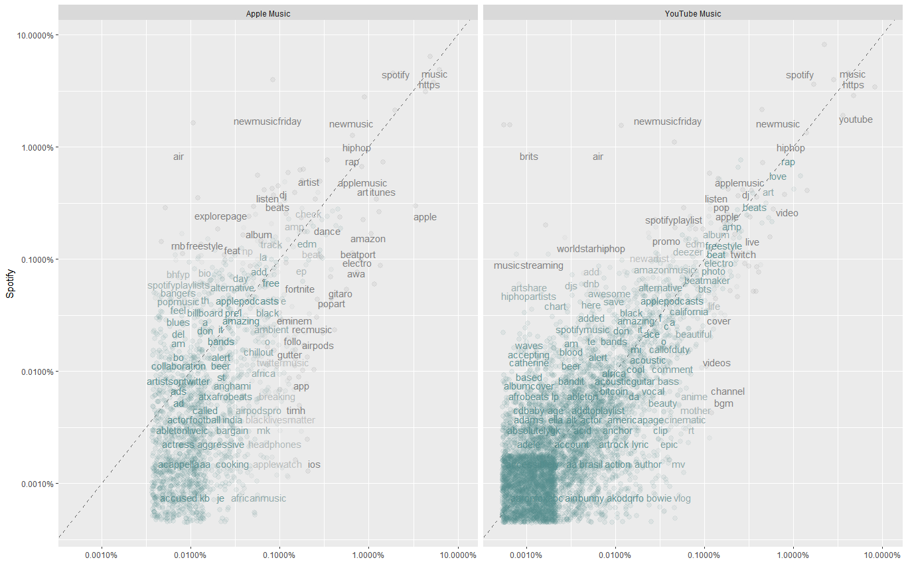
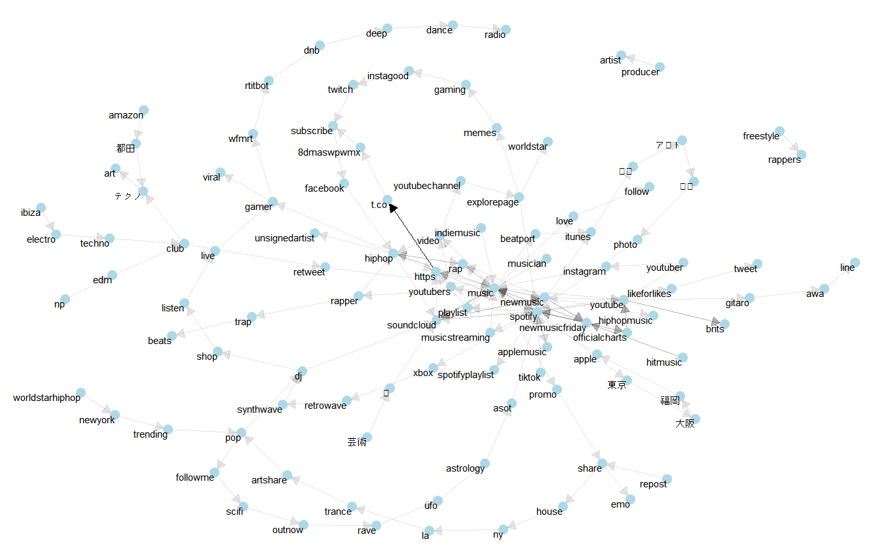
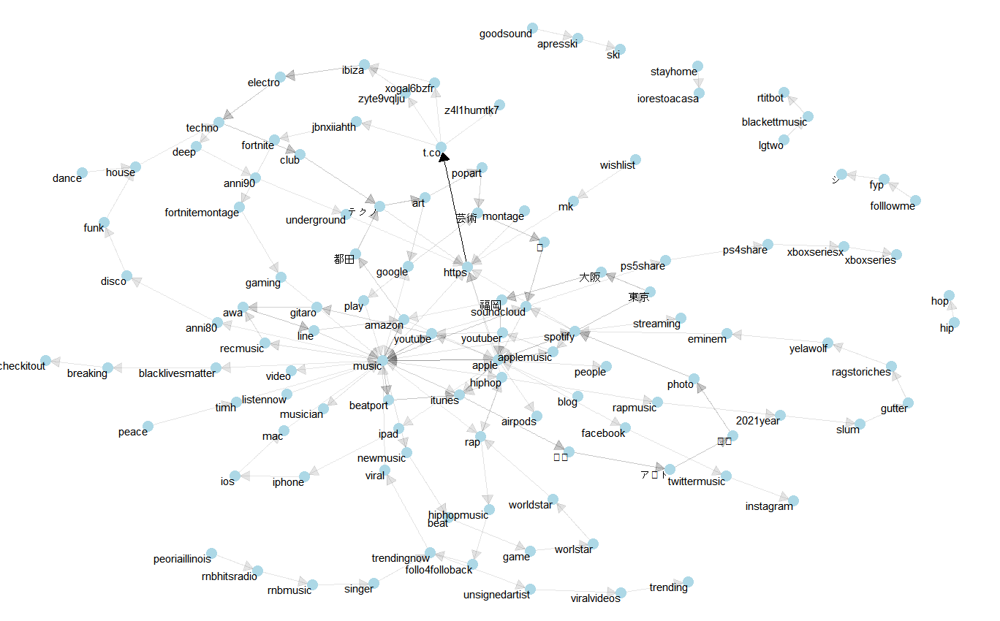
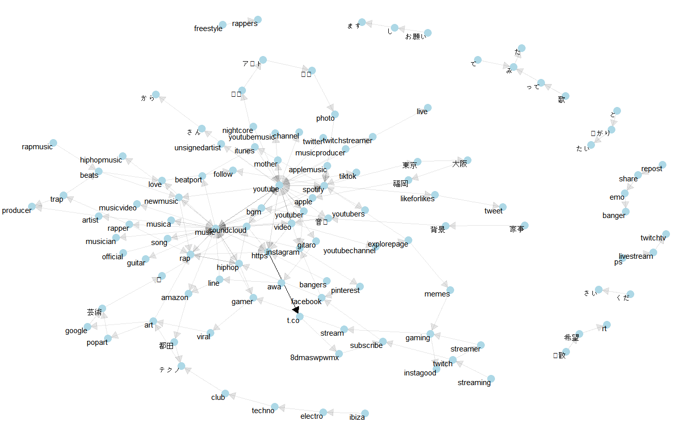

# Tweets Text Analytics

Jisung Jung

Mauricio Teles who is famous as our guest speaker in the HULT MSBA class has a chance to join the digital marketing project in Nike Inc. This global sportswear company is setting up to release a new Air Max sneaker shoes on Mar. 1st. As Its executives want to increase sales and revenue in the new product, they let the project team prepare for a business insight report from social media and ask for building an advertising strategy targeted for the customers who enjoy listening to music from media streaming platforms and applications. Mauricio is excited that he can demonstrate his outstanding business analytics skills to the project team. In order to meet their request, he starts to use Twitter to bring text data, examines the biggest music streaming platform’s characteristics and interests dividing by Spotify, Apple Music, and YouTube Music, visualizes significant relationships among data afterward.

`R Script` is available in this [link](https://drive.google.com/file/d/1O0VQ91xvB_CUFWyJIBySJoIvbHWMqwIA/view?usp=sharing) 

### I. Comparing the word frequencies

Thanks to `rtweet`, he can gather the Apple Music dataset with 518 observations, tagged keyword by #Apple #music, YouTube Music dataset with 3714 observations, tagged keyword by #YouTube #music, Spotify dataset with 5248 observations, tagged by #Spotify #music. He transforms those datasets into tidy text format by tokenizing, removing stop words, counting frequencies for tokens. In order to compare the word frequencies of Spotify, Apple Music, and YouTube Music, he binds the tidy dataset together, reshapes (spread and gather each the service and proportion) and plots the set of texts as shown in Figure 1.

<figure>

<figcaption align="center"> Figure 1. Comparing the word frequencies of Spotify, Apple Music, and YouTube Music </figcaption>
</figure>

He can see some insights between the two graphs.

- Rap, Hiptop, Electronic dance music are notable and favorite genres these days.
- All platforms provide the podcast radio with series of contents of news, broadcasts, storytelling, music.
- Spotify is likely to focus on the listeners whose music taste is unique, regularly using ‘newmusicfriday’ curated playlist. By comparison with YouTube, Spotify seems to pay attention to British hits music.
- Apple is correlated with Apple hardware(AirPods, headphones, apple watch, etc) and software(app, itunes, ios). 
- Apple seems to be special in introducing many African musical style songs (Afrobeat, africa, African music)
- YouTube music is engaging with streaming video viewers who consume the live clip, music video, beauty channels. Other platforms are centered on artists' music but YouTube serves fewer artist music like bgm, cinematic, anime.

Besides, after he runs cor.test function he can see a 0.782 correlation index between Apple Music and Spotify and a 0.787 correlation index between YouTube Music and Spotify.

```
Pearson's product-moment correlation

data:  proportion and Spotify
t = 51.979, df = 1718, p-value < 2.2e-16
alternative hypothesis: true correlation is not equal to 0
95 percent confidence interval:
 0.7627784 0.7995726
sample estimates:
      cor 
0.7818554 
```

```
Pearson's product-moment correlation

data:  proportion and Spotify
t = 96.499, df = 5712, p-value < 2.2e-16
alternative hypothesis: true correlation is not equal to 0
95 percent confidence interval:
 0.7772178 0.7969422
sample estimates:
      cor 
0.7872813 
```

### II. Visualizing a Network of Bigrams

After comparing the word frequencies, Mauricio explores Relationships Between Words. He applies organizing tokens into pairs of two consecutive words, called “bigrams”. From a tidy object, each company’s network can be manipulated and be developed the most common word-to-word connection.
Figure 2. ~ Figure 4. visualize the common bigrams in Music Streaming Services with some polishing, showing clusters of words.

<figure>

<figcaption align="center"> Figure 2. Network graph for common bigrams in Spotify </figcaption>
</figure>

<figure>

<figcaption align="center"> Figure 3. Network graph for common bigrams in Apple </figcaption>
</figure>

<figure>

<figcaption align="center"> Figure 4. Network graph for common bigrams in YouTube </figcaption>
</figure>

There are some findings from those network graphs.

- Soundcloud is one of the largest word shaping common centers of nodes.

- Music lovers are also fascinated with club (ex. ibiza) where playing dance music.

- Spotify is well used by people in a great interest for electronic-based music (trance, wave, house, techno, edm)

- Game consoles(PS4, PS5, Xbox) are actively used for user to play the Apple Music

- Music producer, Twitch streamer and gamer are expected to play a great role in recurring YouTube music service.


### III.  Business decision based upon findings

From the above Twitter text analysis, he suggests some recommendations as an advertising strategy.

- Make commercials with the well-known rapper. Or commercial music collaborated with DJ, hip hop artists.
- Release podcasts about the entertaining story of Air Max, sneakers, Nike sportswear.
- Provide various moods playlist curated by Nike on Spotify to express that Nike Inc. loves music and its vibes.
- Post live session, performance audio on the SoundCloud to get a comment from music creators and SoundCloud community users 
- Participate in Apple events, festivals, and sponsor of African performers such as apparels, shoes, accessories & equipment.
- Joint development with Nike sportswear and Apple product.
- Shoot many entertaining videos and release them on YouTube to increase more subscribers on the Nike YouTube channel. Try to include their new Air Max commercials on influencer’s video while commercial break.
- Treat music producer, rappers, Club DJs, Twitch streamer and gamer as value-added influencers to go viral. Allow them to distribute redeem coupons and promo codes. Ask them increase the tweets, posts in terms of the new Air Max sneaker shoes. 

